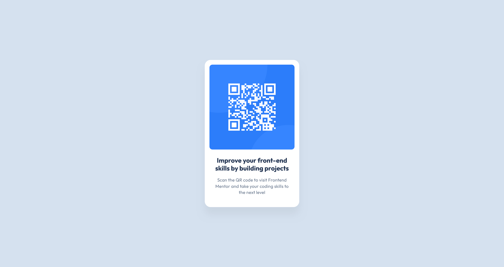

# Frontend Mentor - QR code component solution

This is a solution to the [QR code component challenge on Frontend Mentor](https://www.frontendmentor.io/challenges/qr-code-component-iux_sIO_H). Frontend Mentor challenges help you improve your coding skills by building realistic projects.

## Table of contents

- [Overview](#overview)
  - [Screenshot](#screenshot)
  - [Links](#links)
- [My process](#my-process)
  - [Built with](#built-with)
  - [What I learned](#what-i-learned)
  - [Continued development](#continued-development)
  - [Useful resources](#useful-resources)
- [Author](#author)

## Overview

### Screenshot

### Links

- Solution URL: [Add solution URL here](https://github.com/Komposit-Studio/qr-code-component)
- Live Site URL: [Add live site URL here](https://komposit-studio.github.io/qr-code-component/)

## My process

### Built with

- Semantic HTML5 markup
- CSS custom properties
- Flexbox

### What I learned

It's been a while since I worked with HTML and CSS but it was mostly a refresher, especially on flexbox and using custom properties.

What was new to me that I learned while reading through the MDN documents was about using _border-box box-sizing_ to eliminate having to calculate widths in relation to padding.

Another new thing to me was using _dvh_ for the body height which eliminated mobile viewport height issues.

### Continued development

I want to continue expanding my knowledge on flexbox, grid, and responsive web design.

### Useful resources

- [MDN - box-sizing](https://developer.mozilla.org/en-US/docs/Web/CSS/Reference/Properties/box-sizing) - Introduced me to a much easier way of working with layout lengths.
- [CSS-Tricks - flexbox](https://css-tricks.com/snippets/css/a-guide-to-flexbox/) - Great as a learning article as well as a quick reference.

## Author

- Frontend Mentor - [@Komposit-Studio](https://www.frontendmentor.io/profile/Komposit-Studio)
